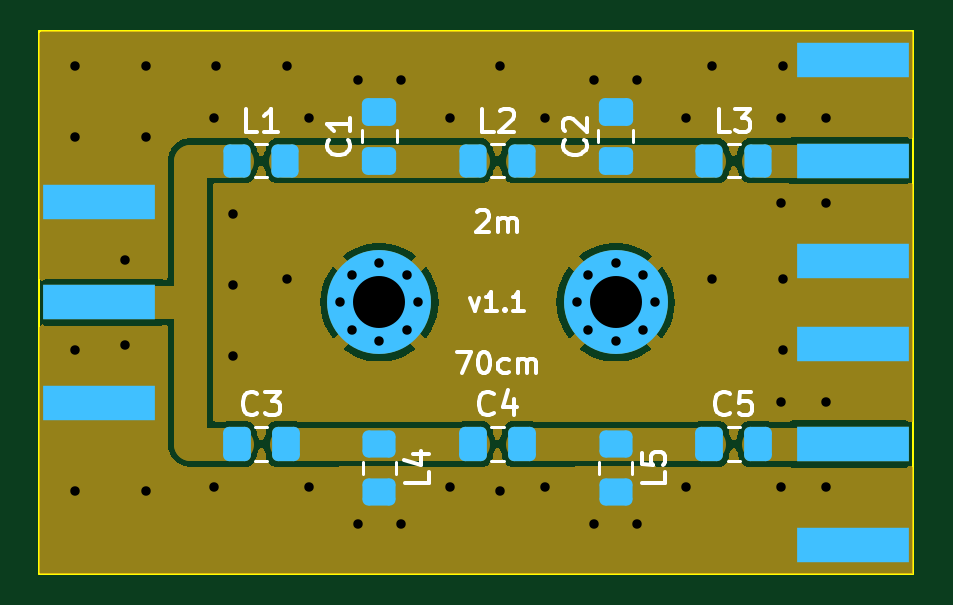
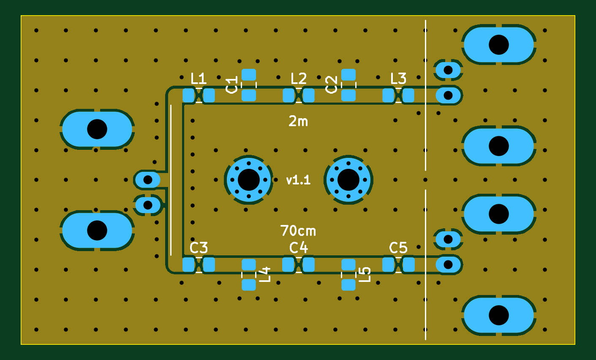
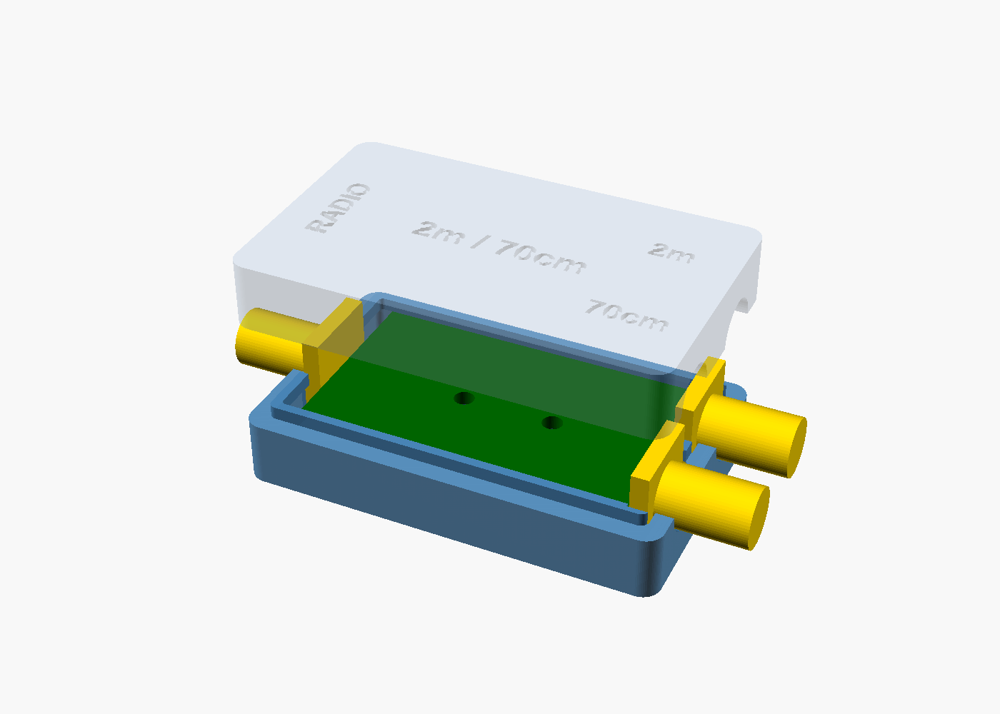
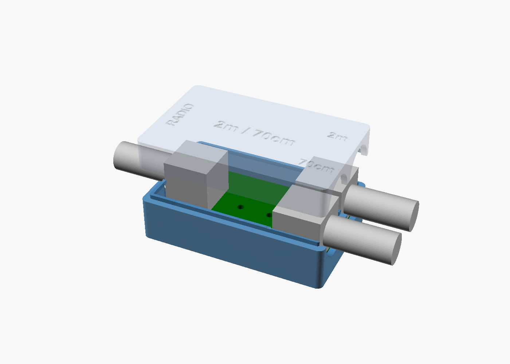
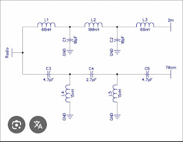

# Diplexor 2 m / 70 cm: PCB y caja imprimible (SMA y BNC)

Diplexor pasivo que separa las bandas de **2 m (144–146 MHz)** y **70 cm (430–440 MHz)** de un único conector de radio. Hay dos versiones que solo se diferencian en los conectores (**SMA** o **BNC**). Cada una tiene su PCB de 2 capas y su caja para impresora 3D, diseñada lo más compacta posible.

| | SMA | BNC |
|---|---|---|
| PCB | 37 × 23 mm | 55.5 × 33 mm |
| Caja (exterior) | **45.2 × 27.6 × 14.1 mm** | **59.9 × 37.6 × 23.5 mm** |
| Conector | Amphenol 132289 (canto, bulkhead) | Amphenol B6252HB-NPP3G-50 (acodado) |
| Tornillos | 2 × M2 × 10 autorroscantes | 2 × M2 × 12 autorroscantes |






## Circuito



- **2 m:** paso bajo formado por L1 68 nH, C1 18 pF, L2 100 nH, C2 18 pF y L3 68 nH.
- **70 cm:** paso alto formado por C3, L4 15 nH, C4, L5 15 nH y C5.

En el esquema original, el valor de C1/C2 es ambiguo (10 o 18 pF). Se ha usado **18 pF** porque con 10 pF la rama de 2 m queda desadaptada.

### Valores recomendados
Con los valores del esquema (C3 = C5 = 4.7 pF, C4 = 2.7 pF), la rama de 70 cm queda mal adaptada (S11 ≈ −6.4 dB, ROE ≈ 2.8). Con **C3 = C5 = 8.2 pF y C4 = 4.7 pF** mejora mucho. Se usan las mismas huellas:

| Simulación (ideal) | Esquema | Optimizado |
|---|---|---|
| S11 a 145 MHz | −19 dB | −31 dB |
| S11 a 435 MHz | −7 dB | −31 dB |
| Pérdida de inserción | 0.05 / 0.9 dB | < 0.05 dB |
| Aislamiento entre 2m y 70cm | > 50 dB | > 49 dB |

Puedes reproducirla con `make sim`.

## Estructura del repositorio
```
hardware/{SMA,BNC}/        Proyecto KiCad 7 (.kicad_pcb/.kicad_pro) + board_geometry.json
fabrication/{SMA,BNC}/     Gerber, taladros, zip para el fabricante, BOM, pick&place, informe DRC
enclosure/diplexor_caja.scad   Caja paramétrica (OpenSCAD)
enclosure/stl/             STL listos para imprimir (base + tapa por versión)
BOM/                       Listas de materiales (fuente)
scripts/                   Generador de PCB, simulador y script de build
docs/                      Imágenes, pruebas y montaje
```

## Fabricar la PCB
Sube `fabrication/<VERSION>/gerber_diplexor_2m70cm_<VERSION>.zip` al fabricante con estos parámetros:
- 2 capas, FR4 de **1.6 mm**, cobre de 1 oz y acabado HASL o ENIG.
- Pista y separación mínimas: 0.25 / 0.2 mm. Vía: 0.4 / 0.8 mm.
- Las líneas de RF son CPWG de 50 Ω (pista de 1.4 mm con 0.25 mm de separación a masa). El grosor de 1.6 mm es necesario para mantener esa impedancia.

## Imprimir la caja
- **Material:** PETG (recomendado) o PLA. Capa de 0.2 mm, 3 perímetros, relleno del 20 % o más.
- **Orientación:** la base con el suelo sobre la cama. La tapa ya se exporta boca abajo, con el techo sobre la cama.
- No hacen falta soportes. Los semicírculos de los conectores quedan como pequeños puentes.
- Es una caja "almeja": se abre a la altura del eje de los conectores. Un labio de 1.4 mm centra la tapa sobre la base.

Más detalles en [docs/MONTAJE.md](docs/MONTAJE.md).

> **Importante:** las medidas de los conectores de la caja (brida del SMA, altura y frontal del BNC) son estimaciones a partir de la huella de KiCad. **Mide tu conector con un calibre** y ajusta los parámetros `SMA_*` / `BNC_*` al principio de `enclosure/diplexor_caja.scad` antes de imprimir la versión final. También conviene imprimir primero solo la base y comprobar el ajuste.

## Pruebas
Consulta el protocolo con NanoVNA en [docs/PRUEBAS.md](docs/PRUEBAS.md).

## Regenerar todo
Requisitos: KiCad 7 (`kicad-cli` y el módulo Python `pcbnew`), `gerbv`, `openscad`, `python3-numpy` y `xvfb` (para los renders).
```bash
make          # PCB + DRC + Gerber + BOM/pos + imágenes + STL
make sim      # simulación del filtro
```
Todo sale de `scripts/gen_pcb.py`. La caja lee la posición de los conectores y de los agujeros desde `hardware/*/board_geometry.json`, así que si se mueve un conector en la PCB, la caja se adapta sola.

## Limitaciones
- Con componentes 0805 admite unos **5–10 W**, suficiente para equipos portátiles o QRP. Para más potencia hay que usar bobinas al aire y condensadores de mica o ATC.
- La caja de plástico no apantalla. La PCB lleva planos de masa en las dos caras con vías de cosido. Si hace falta blindaje, se puede pintar el interior con pintura conductora o forrarlo con cinta de cobre.
